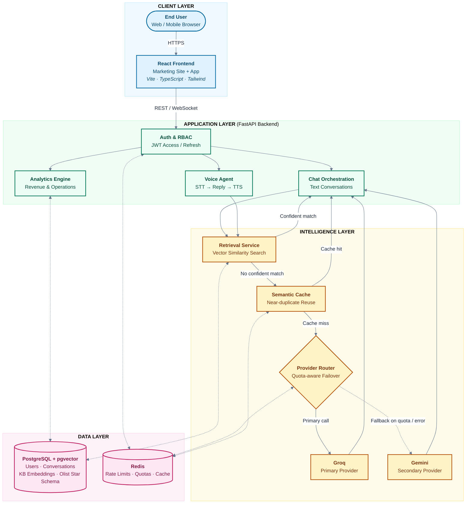

# SupportSense

## 1. Overview

SupportSense is an AI-powered customer support platform built for
e-commerce and services businesses that need to answer customer questions
accurately, respond by voice as well as by text, and understand the revenue
and operational impact of their support activity in one place. It combines a
retrieval-augmented chat assistant, a voice agent, and a revenue and
operations analytics dashboard on top of a single, shared data and
authentication layer.

## 2. Objectives

- Answer customer questions directly and accurately from a curated support
  knowledge base whenever possible, before ever invoking a paid language
  model.
- Preserve availability by automatically failing over between two
  independent language model providers when the primary provider is
  rate-limited or unavailable, rather than allowing the support experience to
  degrade.
- Extend the same conversational experience to voice, so customers can speak
  their question and receive a spoken answer.
- Give business and support teams a live, trustworthy view of order,
  delivery, and customer growth metrics without a separate analytics tool.
- Meet a professional security, testing, and deployment bar throughout,
  suitable for a production release rather than a prototype.

## 3. What We Build

SupportSense is delivered as three cooperating applications sharing one
backend and one data layer:

- **A public marketing site** that introduces the product and routes visitors
  to sign up or log in.
- **An authenticated application** providing a real-time chat interface, a
  voice interface with live transcription and synthesized speech, and a
  revenue and operations analytics dashboard with filterable charts and CSV
  export.
- **A FastAPI backend** that owns authentication, role-based access control,
  the retrieval-augmented chat pipeline, the language model provider router,
  the voice pipeline, and the analytics engine, all backed by PostgreSQL with
  the pgvector extension and Redis.

## 4. How It Helps

- **Faster, cheaper answers.** Common questions are answered directly from
  the knowledge base through vector similarity search, at a fraction of the
  cost and latency of a language model call.
- **Resilient escalation.** Questions the knowledge base cannot answer
  confidently are routed to a language model, with automatic failover to a
  secondary provider if the primary is rate-limited or unavailable, so the
  support experience keeps working through provider-side disruptions.
- **One experience, two channels.** The same retrieval and provider-routing
  pipeline powers both the chat interface and the voice agent, so behavior is
  consistent regardless of how a customer chooses to ask.
- **Business visibility.** The analytics dashboard turns raw order, delivery,
  and customer data into decision-ready metrics for support and business
  stakeholders, without requiring a separate business intelligence tool.
- **Production-grade foundations.** Security hardening, automated testing at
  the unit, integration, and load level, and a documented deployment and
  rollback path are treated as first-class requirements rather than
  afterthoughts.

## 5. Architecture

The chat and voice endpoints first attempt to answer from the support
knowledge base through vector similarity search. When no result clears the
confidence threshold, the request passes through a semantic cache and then
the language model provider router, which tries the primary provider first
and automatically fails over to the secondary provider on rate limiting or
error. The voice agent wraps the same pipeline with speech-to-text and
text-to-speech. The analytics dashboard reads from a star schema built from
the Olist e-commerce dataset, independent of the conversational pipeline, and
both pipelines share the same PostgreSQL and Redis instances.



## 6. Tech Stack

| Layer | Technology |
|---|---|
| Frontend | React 19, TypeScript, Vite, Tailwind CSS, Recharts, React Router |
| Backend | FastAPI, Pydantic v2, SQLAlchemy 2, Alembic |
| Database | PostgreSQL with the pgvector extension |
| Cache and rate limiting | Redis, slowapi |
| LLM providers | Groq (primary), Google Gemini (secondary) |
| Embeddings | sentence-transformers (`BAAI/bge-small-en-v1.5`) |
| Speech-to-text | faster-whisper |
| Text-to-speech | edge-tts |
| Authentication | JWT access and refresh tokens, passlib/bcrypt password hashing |
| Testing | pytest (backend), Vitest and React Testing Library (frontend) |
| CI/CD | GitHub Actions |
| Containerization | Docker (multi-stage, non-root backend image) |

## 7. Prerequisites

- Python 3.12 or later
- Node.js 20 or later
- Docker and Docker Compose (for local PostgreSQL and Redis)
- A free Groq API key and a free Google Gemini API key, for LLM-backed answers
  (the knowledge-base-direct path and the test suite work without either key,
  but chat and voice fallback answers require at least one)

## 8. Local Setup

### 8.1 Start PostgreSQL and Redis

```bash
docker compose up -d
```

This starts a `pgvector/pgvector:pg16` PostgreSQL instance on port 5432 and a
Redis instance on port 6379, matching the defaults in `backend/.env.example`.

### 8.2 Backend

```bash
cd backend
python -m venv .venv
.venv/Scripts/activate   # on Windows; use `source .venv/bin/activate` on macOS/Linux
pip install -e ".[dev]"
cp .env.example .env     # then fill in GROQ_API_KEY and GEMINI_API_KEY
alembic upgrade head
uvicorn app.main:app --reload
```

The API is now available at `http://localhost:8000`.

### 8.3 Frontend

```bash
cd frontend
npm install
cp .env.example .env     # VITE_API_BASE_URL defaults to http://localhost:8000
npm run dev
```

The app is now available at `http://localhost:5173`.

### 8.4 Environment variables

See `backend/.env.example` and `frontend/.env.example` for the full list.
The variables that must be set for a working local environment beyond the
defaults are:

| Variable | Where | Purpose |
|---|---|---|
| `DATABASE_URL` | backend | PostgreSQL connection string |
| `REDIS_URL` | backend | Redis connection string |
| `JWT_SECRET_KEY` | backend | Signing key for access and refresh tokens; must be a unique secret outside local development |
| `GROQ_API_KEY` | backend | Primary LLM provider key |
| `GEMINI_API_KEY` | backend | Secondary LLM provider key |
| `VITE_API_BASE_URL` | frontend | Base URL the frontend calls for the backend API |

## 9. Datasets

SupportSense uses two third-party datasets, neither of which is committed to
source control. Full download and load instructions, including licensing
detail for each, are in `data/README.md`; the short version:

1. **Support knowledge base**: the Bitext customer support dataset, loaded
   into PostgreSQL and embedded for semantic search.
2. **Revenue and operations data**: the Olist Brazilian e-commerce dataset,
   loaded into a star schema used by the analytics dashboard.

```bash
# after activating the backend virtual environment and applying migrations
python data/scripts/load_support_kb.py
python data/scripts/generate_embeddings.py
python data/scripts/build_star_schema.py
python data/scripts/validate_data.py
```

## 10. Running the Application Locally

With PostgreSQL, Redis, the backend, and the frontend all running as
described above, visit `http://localhost:5173` for the marketing site and
authenticated app. Interactive API documentation is available at
`http://localhost:8000/docs` (Swagger UI) and `http://localhost:8000/redoc`
in any non-production environment; both are disabled when
`ENVIRONMENT=production`.

## 11. Running Tests

**Backend** (from `backend/`, with the virtual environment active and
PostgreSQL/Redis running):

```bash
pytest                 # unit and integration tests
pytest -m load         # synthetic load test for the provider fallback logic
```

**Frontend** (from `frontend/`):

```bash
npm test
```

See `docs/MANUAL_QA_CHECKLIST.md` for the manual QA checklist covering the
full user journey, to run before a release.

## 12. Deployment

See `docs/DEPLOYMENT.md` for full instructions covering the production
Docker image, hosting PostgreSQL, Redis, the backend, and the frontend on
free tiers, the GitHub Actions CI/CD workflow, rollback steps, and
monitoring.

## 13. LLM Provider Fallback and API Keys

Chat and voice requests that are not answered directly from the knowledge
base are sent to the LLM provider router, configured with Groq as the primary
provider and Gemini as the secondary provider. The router tracks each
provider's request quota in Redis and, when the primary provider is
rate-limited, exhausted, or returns an error, automatically retries the
request against the secondary provider before failing the request. This
behavior is exercised directly by the synthetic load test at
`backend/tests/load/test_chat_fallback_load.py`.

To enable LLM-backed answers, obtain a free API key from
[Groq](https://console.groq.com) and a free API key from
[Google AI Studio](https://aistudio.google.com) for Gemini, then set
`GROQ_API_KEY` and `GEMINI_API_KEY` in `backend/.env`. The application
functions without either key, but requests that fall through the knowledge
base with no confident match will fail with a clear error instead of
returning an LLM-generated answer.

## 14. Project Folder Structure

```
supportsense/
  backend/
    app/
      api/            REST and WebSocket route handlers
      core/           settings, security, logging, rate limiting
      db/             database and Redis session management
      models/         SQLAlchemy models
      schemas/        Pydantic request and response schemas
      services/       business logic, including the LLM provider router
    alembic/          database migrations
    tests/
      unit/           provider router, retrieval, and prompt logic tests
      integration/    API flow tests against a real test database
      load/           synthetic load test for provider fallback
    Dockerfile        production backend image
  frontend/
    src/
      components/     chat, voice, and dashboard UI components
      pages/           top-level routed pages
      lib/             API client and shared utilities
      context/         React context providers (authentication)
  data/
    scripts/          dataset download, load, and validation scripts
    README.md         dataset licensing and load instructions
  docs/
    DEPLOYMENT.md
    MANUAL_QA_CHECKLIST.md
  .github/workflows/
    ci.yml            lint, test, and deploy pipeline
  docker-compose.yml   local PostgreSQL and Redis
```

## 15. Licensing

The SupportSense source code in this repository is licensed under the MIT
License; see `LICENSE` for the full text.

The two third-party datasets used by this project carry their own licenses,
separate from the code:

- The support knowledge base dataset
  (`bitext/Bitext-customer-support-llm-chatbot-training-dataset`) is
  distributed under the Community Data License Agreement - Sharing
  (CDLA-Sharing).
- The revenue and operations dataset (`olistbr/brazilian-ecommerce`) is
  distributed by Olist for public research and demonstration use; consult the
  dataset's page on Kaggle for its current terms before any use beyond this
  project's demonstration purpose.

Neither dataset is redistributed within this repository; `data/README.md`
documents how to download each one directly from its source.
